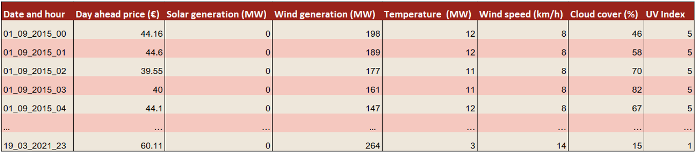
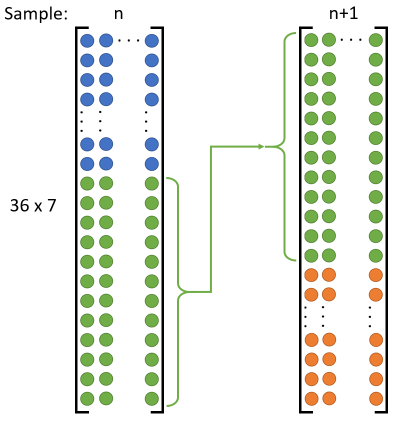
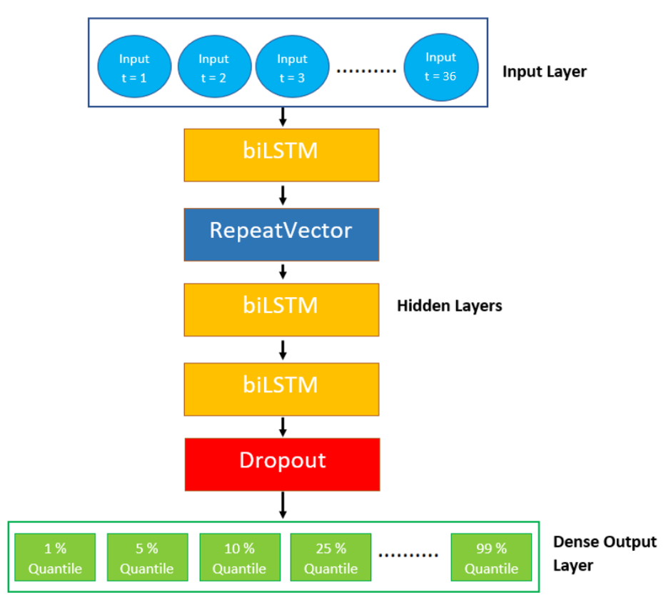

<!-- Output copied to clipboard! -->

<!-----
NEW: Check the "Suppress top comment" option to remove this info from the output.

Conversion time: 8.61 seconds.

Using this Markdown file:

1. Paste this output into your source file.
2. See the notes and action items below regarding this conversion run.
3. Check the rendered output (headings, lists, code blocks, tables) for proper
   formatting and use a linkchecker before you publish this page.

Conversion notes:

* Docs to Markdown version 1.0β29
* Fri Apr 16 2021 10:14:29 GMT-0700 (PDT)
* Source doc: Blog
* This document has images: check for >>>>>  gd2md-html alert:  inline image link in generated source and store images to your server. NOTE: Images in exported zip file from Google Docs may not appear in  the same order as they do in your doc. Please check the images!

----->

>>>>>  gd2md-html alert:  ERRORs: 0; WARNINGs: 0; ALERTS: 11.

<ul style="color: red; font-weight: bold"><li>See top comment block for details on ERRORs and WARNINGs. <li>In the converted Markdown or HTML, search for inline alerts that start with >>>>>  gd2md-html alert:  for specific instances that need correction.</ul>

Links to alert messages:
<a href="#gdcalert1">alert1</a>
<a href="#gdcalert2">alert2</a>
<a href="#gdcalert3">alert3</a>
<a href="#gdcalert4">alert4</a>
<a href="#gdcalert5">alert5</a>
<a href="#gdcalert6">alert6</a>
<a href="#gdcalert7">alert7</a>
<a href="#gdcalert8">alert8</a>
<a href="#gdcalert9">alert9</a>
<a href="#gdcalert10">alert10</a>
<a href="#gdcalert11">alert11</a>

>>>>> PLEASE check and correct alert issues and delete this message and the inline alerts.

# Predicting Day-Ahead Electricity Prices

Hüseyin Harmankaya (4674057, [H.Harmankaya@student.tudelft.nl](mailto:H.Harmankaya@student.tudelft.nl))
Serkan Simsek (4566327, [M.S.Simsek@student.tudelft.nl](mailto:M.S.Simsek@student.tudelft.nl))
Github repository: [https://github.com/MSSerk/Reproducibility-paper.git](https://github.com/MSSerk/Reproducibility-paper.git)

## Introduction

In the current electricity price forecasting market, complex dependencies exist between the electricity prices and certain energy actors. A variety of deep learning methods have been used for electricity price forecasting. The authors of the paper “Deep Learning-Based Multivariate Probabilistic Forecasting for Short-Term Scheduling in Power Markets” attempt to predict the day-ahead electricity prices, by making use of a bidirectional Long Short-Term Memory (bi-LSTM) network [1]. 

In this blog we will take you through our process and results of attempting to reproduce this paper. The main goal of this reproducibility project was to reproduce figure 6d of the paper, which contains the day-ahead electricity prices for seven consecutive days and can be seen in the figure below.

>>>>>  gd2md-html alert: inline image link here (to images/image1.png). Store image on your image server and adjust path/filename/extension if necessary.  (<a href="#">Back to top</a>)(<a href="#gdcalert2">Next alert</a>) >>>>> 

The authors of this paper use the quantile loss function to predict the quantiles of the day-ahead electricity prices. In order to reproduce these results, we have created our own python codes from scratch since there were no codes provided along with the paper. We implemented the code in two Jupyter Notebook files which can be found in our Github repository along with other important files: [https://github.com/MSSerk/Reproducibility-paper.git](https://github.com/MSSerk/Reproducibility-paper.git)** **

The Jupyter Notebook files contain among others, the bi-LSTM model (created in tensorflow), the chosen hyperparameters, and many more useful data. We started the reproduction by first choosing and collecting our data. 

## Data

The authors of the paper did not provide the dataset they used to get to their results. So, we chose to use the following features based on the content of the paper: day-ahead electricity prices, wind and solar generation forecast, and the weather consisting of temperature, wind speed, cloud cover and solar radiation. The data needed to obtain these features were retrieved from two different sources. To match the paper, the location for the retrieved data is Brussels, Belgium.

### Collecting the data

We used [https://transparency.entsoe.eu/](https://transparency.entsoe.eu/generation/r2/dayAheadGenerationForecastWindAndSolar/show?name=&defaultValue=true&viewType=TABLE&areaType=BZN&atch=false&dateTime.dateTime=01.03.2015+00:00|CET|DAYTIMERANGE&dateTime.endDateTime=01.03.2015+00:00|CET|DAYTIMERANGE&area.values=CTY|10YBE----------2!BZN|10YBE----------2&productionType.values=B16&productionType.values=B18&productionType.values=B19&processType.values=A18&processType.values=A01&processType.values=A40&dateTime.timezone=CET_CEST&dateTime.timezone_input=CET+(UTC+1)+/+CEST+(UTC+2)) to download the historic day-ahead prices and the solar and wind generation forecasts. This was done by downloading each year in separate CSV files. The weather data was obtained from [https://www.worldweatheronline.com/brussels-weather-history/be.aspx](https://www.worldweatheronline.com/brussels-weather-history/be.aspx) by using an API to get the data for multiple years at once, so it consists of just one CSV file. This file also has more weather related features, but these were not used for our reproduction. The CSV files can be found in the Github repository.

All of the data is from the start of the year 2015 until the 19th of March 2021,where the timestep between the data is one hour. This period was narrowed down in the codes since there were a few data points missing at the first half of 2015, so we only used data starting from the 1st of September 2015. The data obtained from [https://transparency.entsoe.eu/](https://transparency.entsoe.eu/generation/r2/dayAheadGenerationForecastWindAndSolar/show?name=&defaultValue=true&viewType=TABLE&areaType=BZN&atch=false&dateTime.dateTime=01.03.2015+00:00|CET|DAYTIMERANGE&dateTime.endDateTime=01.03.2015+00:00|CET|DAYTIMERANGE&area.values=CTY|10YBE----------2!BZN|10YBE----------2&productionType.values=B16&productionType.values=B18&productionType.values=B19&processType.values=A18&processType.values=A01&processType.values=A40&dateTime.timezone=CET_CEST&dateTime.timezone_input=CET+(UTC+1)+/+CEST+(UTC+2)) also missed data for one timestamp and had a duplicate for one timestamp each year. This is due to the switch from wintertime to summertime and back again. The missing data point was obtained by interpolating between the timestamps before and after it and the duplicate data was resolved by only keeping the first data point and removing the second. The weather data did not have this issue.

### Merging the weather, generation and electricity price data

Since we are using data from two different sources, it might be possible that the timestamps do not match each other. So, we made sure that each timestamp was written in the same format when loading in the data and then compared whether all timestamps matched to then merge the different data accordingly into one array.

After merging all the data together into a single 2D numpy array, the output of the array gets the following structure:  

>>>>>  gd2md-html alert: inline image link here (to images/image2.png). Store image on your image server and adjust path/filename/extension if necessary.  (<a href="#">Back to top</a>)(<a href="#gdcalert3">Next alert</a>) >>>>> 

The next step is to take a random sample from the generated data in order to inspect if the merging of the arrays has been performed successfully. This can be seen in the following lines of code: 

>>>>>  gd2md-html alert: inline image link here (to images/image3.png). Store image on your image server and adjust path/filename/extension if necessary.  (<a href="#">Back to top</a>)(<a href="#gdcalert4">Next alert</a>) >>>>> 

The printed values are compared to the original values in the CSV files to perform a double check on the data, as a misalignment of the weather and generation data can have a significant effect on the model’s performance. 

The processing of the data described up until here is done in the Jupyter Notebook file called _data_processing.ipynb_. In this file, a Numpy file with the data is created and stored. We already provided this Numpy file in the same repository, so it does not need to be created again. The Numpy file is then used in the Jupyter Notebook file called _final_code.ipynb_. This file contains the code for steps that we will describe from here onwards, such as the splitting the data in a training and test set, and creating the network.

### Defining the input and output data

After loading in the data from the Numpy file, we removed the first column containing the dates and times, as this was only added as an extra check. 

We then split this data for training and testing. The training data goes from the 1st of September 2015 until the 1st of February 2021 and the remaining data is made available for testing. Not all of the data is used for testing at once, but chunks of 7 days as we only want to predict 7 days ahead.

The input data (per sample), also known as the input horizon, contains the past 36 hours of electricity prices, weather and generation data taken before the afternoon of the day (12:00). The output data, also known as the prediction horizon, contains the following 36 hours of electricity prices. The prediction horizon of interest is the last 24 hours of the prediction horizon. 

An example of the first sample of the input and output data is given in the figure below. The blue dots are the inputs, while the red dots are the outputs. At the bottom of this figure, the definitions of the different horizons are shown.

>>>>>  gd2md-html alert: inline image link here (to images/image4.png). Store image on your image server and adjust path/filename/extension if necessary.  (<a href="#">Back to top</a>)(<a href="#gdcalert5">Next alert</a>) >>>>> 

The next sample is then shifted 24 hours to the right and added to the numpy array. This can be seen in the following figure where the second sample is shifted 24 hours to the right:

>>>>>  gd2md-html alert: inline image link here (to images/image5.png). Store image on your image server and adjust path/filename/extension if necessary.  (<a href="#">Back to top</a>)(<a href="#gdcalert6">Next alert</a>) >>>>> 

Note that the figures above contain only the electricity prices as input feature, and that the other input features have not been plotted, in order to keep a clear plot.

Since we take timesteps of 24 hours between each sample while having a horizon of 36 hours, it means that each sample uses the last 12 hours from the previous sample. This complicates reshaping the data as certain data will be repeated. This is eventually done by creating each sample separately from the complete dataset and then stacking them on top of each other. This is shown in the figure below, where two consecutive samples of the input data is shown as an example. The last 12 rows of sample n is reused as the first 12 rows of sample n+1. These samples will then be stacked on top of each other.

>>>>>  gd2md-html alert: inline image link here (to images/image6.png). Store image on your image server and adjust path/filename/extension if necessary.  (<a href="#">Back to top</a>)(<a href="#gdcalert7">Next alert</a>) >>>>> 

After seperating the train and test data, and reordering all the data, we get the following input and output shapes for the train and test set:

>>>>>  gd2md-html alert: inline image link here (to images/image7.png). Store image on your image server and adjust path/filename/extension if necessary.  (<a href="#">Back to top</a>)(<a href="#gdcalert8">Next alert</a>) >>>>> 

## Network

Now that the train and test data has been generated, the next step that we performed is to define our bi-LSTM network. The paper has compared multiple different types of deep-learning networks but found that the bi-LSTM network produced the best results.

An LSTM network is a neural architecture which allows the information that it gets fed into to be propagated through time among consecutive steps within the internal state of the network [2]. The single cell LSTM memory block, which is given in the left figure below, contains three gates, known as the input, output and the forget gate. The main principle of these gates is that they allow for the writing, reading and resetting of the information that it is fed to. 

LSTMs have been proven to show promising results as they have also been used in other time series forecastings, e.g. predicting stock prices for quantitative trading [3]. The unidirectional LSTM only uses information of the past as these are the only inputs that are being fed into the memory block.

This is where bi-directional LSTM separates itself from the unidirectional one. Bi-directional LSTMs are an extension of the unidirectional LSTMs where the network works in two directions, one from the future and one from the past. An example of such a bi-directional network is given in the right figure above.

In our reproduction, we made use of a three layered bi-directional LSTM network, which can be seen in the figure below. This is also what has been suggested by the authors of the paper, as these number of layers produced the best predicting model for the day-ahead electricity prices.

>>>>>  gd2md-html alert: inline image link here (to images/image8.png). Store image on your image server and adjust path/filename/extension if necessary.  (<a href="#">Back to top</a>)(<a href="#gdcalert9">Next alert</a>) >>>>> 

The first layer consists of the input layer which has 36 neurons, one for each hour. Each of these input neurons receives 7 input features, which have been defined earlier. 

This output of the input layer is being sent to a bi-directional LSTM layer containing 19 neurons. The number of neurons has been proposed by the authors of the paper to be between 10 to 20 neurons within each hidden layer. 

The output of the first bi-directional LSTM is sent to a repeatvector layer. This repeatvector repeats the input it receives 36 times and this way converts the one-dimensional tensor into a two-dimensional tensor. 

The output of the repeatvector is sent to two sequential bi-direcitonal lstm layers containing 20 and 19 neurons, respectively. The output of the final bi-directional layer is sent to a dropout layer, having a dropout rate of 0.20. This layer has been added to reduce overfitting.

The final output layer is a shared time distributed dense layer. It consists of nine output layers which corresponds to the nine quantiles of interest (q = 1, 5, 10, 25, 50, 75, 90, 95 and 99%). It is extremely important to note that the outputs have their own quantile loss function and that these quantiles are all processed in the same network, instead of creating one network for each quantile. This makes sure that each quantile is based on the exact same network with the same parameters. If we created a separate network for each quantile, the different quantile curves could cross each other since they are all based on different parameters.

This quantile loss for a given prediction _yip_ and outcome _yi_ for quantile _q_ is given by the following equation: 

The full list of hyperparameters used can be found in the table below: 

>>>>>  gd2md-html alert: inline image link here (to images/image9.png). Store image on your image server and adjust path/filename/extension if necessary.  (<a href="#">Back to top</a>)(<a href="#gdcalert10">Next alert</a>) >>>>> 

## Results

Using the trained network to predict the quantiles of our test set gives the following plot.

>>>>>  gd2md-html alert: inline image link here (to images/image10.png). Store image on your image server and adjust path/filename/extension if necessary.  (<a href="#">Back to top</a>)(<a href="#gdcalert11">Next alert</a>) >>>>> 

In this case, we predict the quantiles for the period from the 13th up until and including the 19th of February 2021. We obtain an RMSE error of €9.42 between the predicted value, which is the output of quantile 50 given in blue, and the actual value given in red. The quantile mean loss was €21.16. We can also observe that a large part of the actual values fall between the quantiles 25 and 75. The different losses are also shown in the figure below.

>>>>>  gd2md-html alert: inline image link here (to images/image11.png). Store image on your image server and adjust path/filename/extension if necessary.  (<a href="#">Back to top</a>)(<a href="#gdcalert12">Next alert</a>) >>>>> 

These results differ for the different test set periods, but this period gave one of the best results on our trained model. The specific model we trained is also given in our Github repository and there is a cell in the Jupyter Notebook file which can load this model in. Please note that you need to uncomment this line of code and that you also need to run the first 3 cells of the same file.

## Discussion

Comparing our results to the results of the paper in a quantitative manner, we see that we have an improved RMSE error on our predicted value, since the paper had an RMSE error of €17. We also have an improvement on the quantile mean loss, as the paper obtained a loss of €28. Thus, we have a difference of €7.58 for the RMSE error and €6.84 for the quantile mean loss. As mentioned earlier, this does depend on which week we do our prediction on, so our performances could be worse for a different period of time.

Qualitatively speaking, our quantiles look to be wider, but at the same time smoother. Since we do not have access to the codes of the paper, it is hard to tell what really caused this. It could be the structure of our network, but it could also be the hyperparameters we used to train our network. We also do not know the exact features the paper used since we do not have their dataset. Furthermore, our model seems to predict the actual value better as a significant part sits between the quantiles 25 and 75. This could be partially caused by the actual values we had being less random than the ones the paper used.

It is also interesting to note that our model does capture the decrease of the width of the quantiles at the start and end of the day, just like the plot from the paper. We believe that this is due to it being night time when everyone is sleeping and there is no sun to generate solar power. This means that there is, in general, not that much variability in the data during the night like during the day. There is also a drop in electricity prices in the middle of the day, which is also captured by our model. This drop might be caused by electricity being in more excess due to more solar energy and less consumption since there is no need for, for example, artificial light.

When looking back at the whole process of reproducing the paper, we would like to note that this paper was quite difficult to reproduce. First, the authors did not provide their code nor their dataset. They were also not very explicit about how they exactly implemented everything, as they mainly seemed to focus on the theory behind the application. So, there were no clear descriptions on how they exactly developed their layers and some hyperparameter values were not mentioned. Also, the implementation of the quantile loss in the network was not clearly explained, and there was not that much information available on the internet.

However, our implementation does show that it is possible to get a reproduction which is able to have a better prediction for some cases, but to get a better overview of the differences between the implementation of our work and the paper, we would prefer to also see the codes and data they used.

## References

[1] Toubeau, J. F., Bottieau, J., Vallée, F., & De Grève, Z. (2018). Deep learning-based multivariate probabilistic forecasting for short-term scheduling in power markets. _IEEE Transactions on Power Systems_, _34_(2), 1203-1215.

[2] Hochreiter and J. Schmidhuber, “Long short-term memory,”NeuralComput., vol. 9, no. 8, pp. 1735–1780, 1997.

[3] Zou, Z., & Qu, Z. (2020). Using LSTM in Stock prediction and Quantitative Trading.
